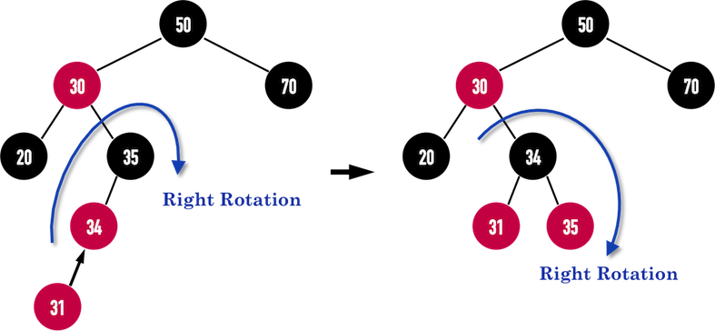

# Quick Sort
1. loop once, choose first unsorted as pivot
2. swap all numbers >pivot to right to pivot
3. after loop, move pivot to end of chosen range
4. mark the pivot as sorted
5. iterate remaining columns
- move high end first
- after swap, switch moving pivot


# text pattern matching
## Brute-Force
start from beginning, match every character until mismatch,
go back to previous starting point+1 step forward

## KMP
1. construct next graph for transfer pointer if failiure
2. start from first char, match each char in match str until mismatch
3. start from current char, move to next n char to compare
next[i] depends on max overlapping of characters for certain substring length

# binary tree
## binary search tree
in-order traversal 

### AVL tree
first invented self-balancing BST

delete: O(log n)
search: O(log n)
space: O(n)

balance_factor = height of right subtree - height of left subtree
balance_factor must be 0/1/-1 for every node in tree
if not, need balance again

#### insertion
follow basic BST, with balancing_factor check for every insertion in each level
declare balancing action matchin to RR,LL,RL,LR four conditions

### Red black tree
BST can decay to linked list if input data is already sorted
1. each node red/black
2. root, all leaves: black
3. no 2 red node link together: if node is red, both child = black
4. every path from given node to descendant path have same num of black nodes

black depth = #black node from root to node
red-black tree less balanced compared to AVL, but much less rotation to balance
  - guarentee < 2x long path from root to nearest leaf
  
all NULL in BST point to NIL in red black tree: NIL always black, allocated memory

#### insert
before inserting node, paint node to red

insert 31:


delete 20:


# heap
## priority queue
get max/min priority each time it pop up

min priority queue: 
1. find max priority
2. delete 
3. insert

types
1. binary head (simpliest)
2. leftist tree
3. binomial heap (most ordered)
4. fibonacci heap (general)

### binary heap
min binary heap: any node < left,right child
output array[1]
1. add new element to last position
2. if node < parent, swap position (bubble up) until node > parent

extract max:
1. output max, bring last element up to root
2. swap to adjust positions
   
# Dynamic programming
slow and naive way, need to compute again:
```c
int f(int n){
  if (n == 0 || n == 1)
    return 1;
  else
    return f(n-1) + f(n-2);
}

```

better is compute and save answer in table: 
## top-down
adv: no need to care about computation sequence
disadv: call function continuously, lower efficiency

```js
let table = Array(600);

const f = n => {
  if (n == 0 || n == 1) return 1
  if (table[n]) return table[n];

  table[n] = f(n-1) + f(n-2);
  return table[n];
}

const stairs_climbing = n => {
  for(let i=0; i<=600; i++)
    table[i] = 0

  while(n >= 0 && n <= 5)
    console.log('climb to', n, 'with', f(n), 'methods')
}
```

## bottom-up
set up computation sequence, start from smallest problem
```js
let table = Array(6)

const dynamic_programming = () => {
  table[0] = 1
  table[1] = 1

  for (let i=2; i<=5; i++)
    table[i] = table[i-1] + table[i-2]
}
```

```js
const x=8, y=8;
let c = Array(x*y)

const staircase_walk = () => {
  for (let j=0; i<y; ++j) c[j] = 1

  for (let i=1; i<x; i++)
    for (let j=1; j<y; j++)
      c[j] += c[j-1]
  
}
```

## efficient multiplication
11 << 3 == 11000
means 
3 * 2^3 == 24


