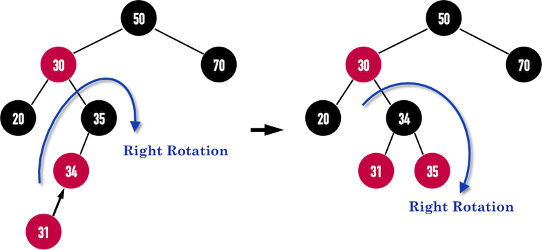
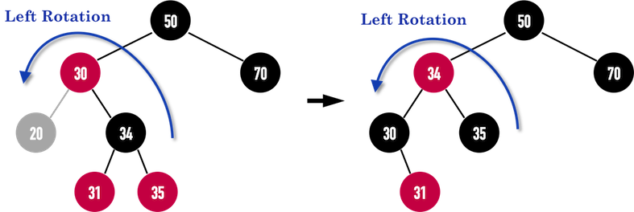

# Array
## fixed size
## dynamic array

# Linked List
## Singly linked
## Circular Linked
## Doubly linked

# Stack 

# binary tree
## binary search tree
in-order traversal 

### AVL tree
first invented self-balancing BST

delete: O(log n)
search: O(log n)
space: O(n)

balance_factor = height of right subtree - height of left subtree
balance_factor must be 0/1/-1 for every node in tree
if not, need balance again

#### insertion
follow basic BST, with balancing_factor check for every insertion in each level
declare balancing action matchin to RR,LL,RL,LR four conditions

### Red black tree
BST can decay to linked list if input data is already sorted
1. each node red/black
2. root, all leaves: black
3. no 2 red node link together: if node is red, both child = black
4. every path from given node to descendant path have same num of black nodes

black depth = #black node from root to node
red-black tree less balanced compared to AVL, but much less rotation to balance
  - guarentee < 2x long path from root to nearest leaf
  
all NULL in BST point to NIL in red black tree: NIL always black, allocated memory

#### insert
before inserting node, paint node to red

insert 31:

delete 20:

# Queue
## priority queue
get max/min priority each time it pop up

min priority queue: 
1. find max priority
2. delete 
3. insert

### implementation
1. binary head (simpliest)
2. leftist tree
3. binomial heap (most ordered)
4. fibonacci heap (general)

# heap
highest/lowest priority stored at root, partially ordered

## binary heap
heap data structure takes form of binary tree, common way implement priority queue

min binary heap: any node < left,right child
output array[1]
1. add new element to last position
2. if node < parent, swap position (bubble up) until node > parent

extract max:
1. output max, bring last element up to root
2. swap to adjust positions

### complexity
space: n/n
search: n/n
insert: 1/log n
find-min: 1/1
delete-min: log n/log n

