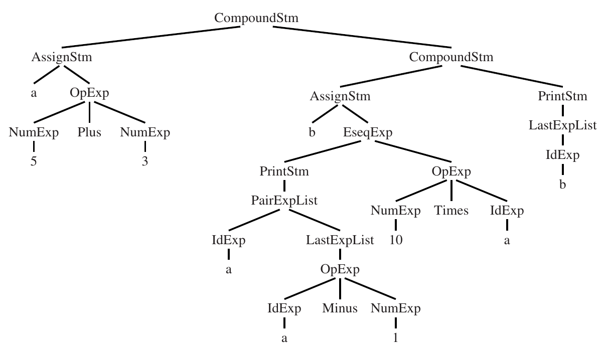
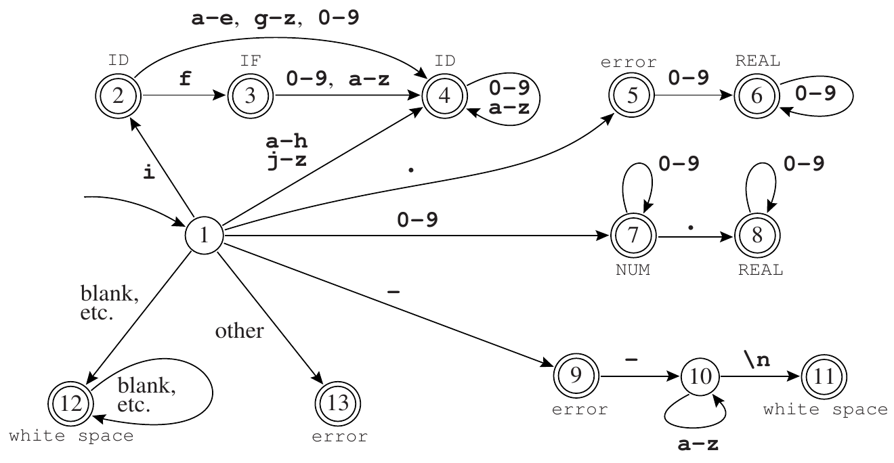
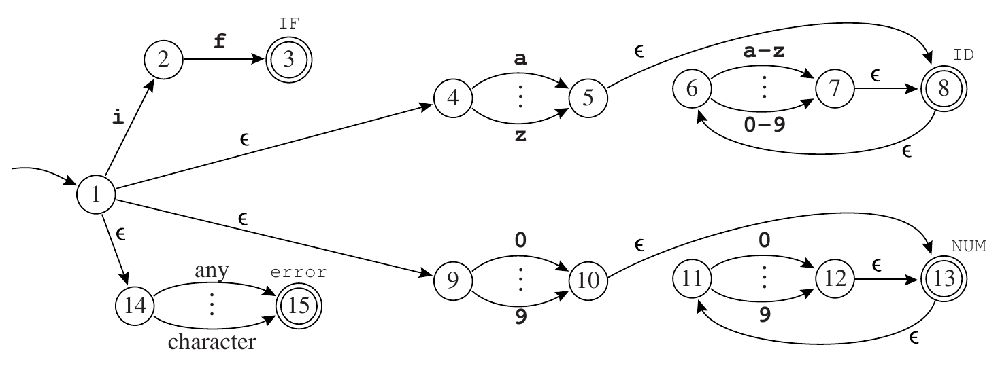
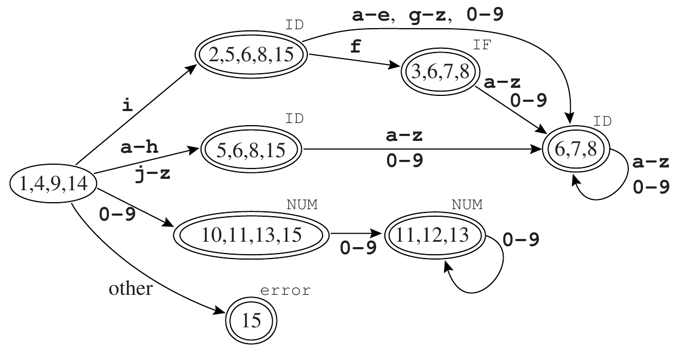
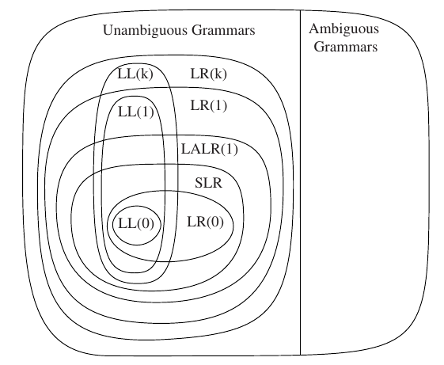
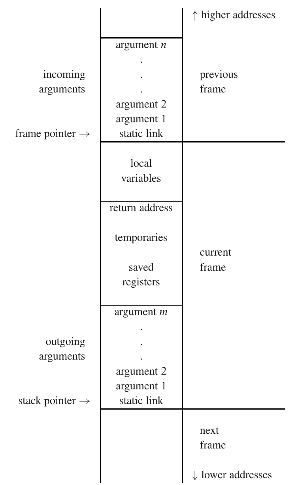

# introduction
## phases
1. Lex : source file -> individual words(token)
2. Parse : analyse phrase structure
3. Semantic Action : build abstract syntax tree
4. Semantic analysis : relate variable -> definitions, check expression, find what each phrase mean
5. Frame layout : place variable into activation records (stack frame)
6. Translate : produce intermediate representation (IR) trees
7. Canonicalize : hoist side effects out of expression, clean conditional branches
8. Instruction selection : group IR tree nodes into clumps -> action of target machine instruction
9. control flow analysis : analyze sequence of instruction
10. Dataflow Analysis : gather info about information flow through variables of program
11. Register allocation : choose register hold each variable, temp values used by program
12. Code Emission : temp names in machine instruction -> machine registers

some compiler combine (Parse, semantic analysis, translate, canonicalize)
useful abstraction: 
- context-free grammar -> parsing
- regular expression -> lexical analysis

## syntax tree
`a := 5+3; b := (print(a, a-1), 10*a); print(b)`



for each variant(CompoundStm, AssignStm) make constructor to malloc, init data structure
1. trees described by grammar
2. tree described by >=1 typedefs -> symbol in grammar
3. each typedef -> pointer in struct
4. each struct contains kind field -> enum showing different variant
5. if >1 value-carrying symbol in right-hand side rule, union component itself comprising test value
6. if =1 value-carrying symbol, union -> value
7. every class constructor init all fields


# Lexical analysis
stream of char -> stream of names,keywords,punctuation
token:
- id, num, real, if, comma, noteq, lparen ...
nontoken:
- comment, preprocessor directive, macro, blanks/tabs/newline

identifier: sequence of letter and digits, first char must be letter/_
## deterministic finite automata (DFA)
regex

```
if              => if
[a-z][a-z0-9]*  => ID
[0-9]+          => NUM
([0-9]+"."[0-9]*)|([0-9]*"."[0-9]+) => REAL
("--"[a-z]*"\n")|(" "|"\n"|"\t")+   => 'do nothing'
.   => error()
```



find longest match, longest initial substring of input that is valid token

## non-deterministic finite automata (NFA)
static, declarative regular expression -> simulatable, quasi-executable NFA



## NFA -> DFA
can avoid need to guess by trying all possibility at once

for every state, we compute ε-closure

start: {1,4,9,14}
i: {2,5,6,8,15}
n: {6,7,8}

string "in":
one of possible state set is 8, which is final => ID

edge(s,c)
- set of all NFA states reachable from state S with label c

## optimization
too costly to do on every char in source program
-> do all sets-of-states calculations in advance
- each set of NFA correspond to 1 DFA state



several members are final => need rule priority
after DFA constructed, state array -> trans array used for lexical analysis

automaton is suboptimal: not smallest one recognize same language
=> apply algorithm to minimize by finding equivalent rules

states s1,s2 equivalent when 
- machine starting in s1 accept "σ" <=> starting in s2 accepts "σ"
- both final / non-final
- for any symbol c, `trans[s1,c] = trnas[s2,c]`

computing ε-closure efficiently by keeping queue / stack of states
regex converted directly to DFAs

DFA transition table very large and sparse (states x symbols)


## start states
regular expression: static, declarative
automata: dynamic, imperative

declare set of start states, each regex prefixed by set of valid start states


# Parsing
```
digits = [0-9]+
sum = expr "+" expr
expr = "("sum")"|digits

(109+23)
61
(1+(250+3))
```
since impossible for N states machine remember () nesting depth > N
=> sum, expr cannot be regex

## context free grammars

grammars define syntatic structure declaratively -> describe structure of lexical tokens
symbol -> symbol symbol ... symbol

symbol = terminal(token from alphabet of string) | non-terminal(appear on LHS of some production)
one non-terminal -> start symbol 

terminal symbol `id print num , + ( ) := ;`
```
a := 7;
b := c + (d := 5 + 6, d)
==>
id := num; id := id + (id := num + num, id)
```

## parse tree
connect each symbol in derivation 
### ambiguous grammars
derive sentence with 2 different parse trees
```
S -> S: S         E -> id     
S -> id := E      E -> num        L -> E
S -> print(L)     E -> E + E      L -> L, E
                  E -> (S, E)

target: `1-2-3`
two possible parse trees:
E -- E -- E -- 1
       -- (-)
       -- E -- 2
  -- (-)
  -- E -- 3
result = (1 - 2) - 3 = -4

E -- E -- 1
  -- (-)
  -- E -- E -- 2
       -- (-)
       -- E -- 3       
result = 1 - (2 - 3) = 2       
```

E: expression, T: term (things you add), F: factor (things you multiply)

## predictive parsing
recursive descent

FIRST(T*F) = {id, num, (}
must keep track of which symbols can produce empty string -> nullable
FOLLOW(X): set of terminals that can immediately follow X

choose one of these clauses based on next token T of input
if we choose right rpoduction for each (X,T), then we can write recursive-descent parser
predictive parsing table
- all info encoded as 2D table of productions, with non-terminals X, terminals T

duplicate entries => predictive parsing won't work
LL(1) [Left-to-right parse]: no duplicate entries
examine left-to-right input in one pass

recursive-descent parsent only look at next token in input
generalize notion of FIRST set to first k tokens of string
=> make LL(k) [rarely done]

## Elimilate left recursion
```
E -> E + T
E -> T
=== rewirte using right recursion ==>
E -> T E'
E' -> + T E'
E' ->

S -> if E then S else S
S -> if E then S
=== left factor ===>
S -> if E then S X
X ->
X -> else S
```

## LR parsing
postpone decision until seen input token corresponding to entire right-hand side of production
LR(k) = rightmost-derivation, k-token lookahead, left-to-right parse

```
a := 7;
b := c + (d := 5 + 6, d)
```
parser has stack, input
Shift: move first input token to top of stack
Reduce: choose gammar rule X -> A B C; pop C,B,A from top of stack; push X onto stack
$: accept end

```
s_n: shift into state n
g_n: goto state n
r_k: reduce by rule k
a: accept
  : error

rules:
0: S' -> S$
1: S -> (L)
2: S -> x
3: L -> S
4: L -> L , S
```
treat shift and goto action as edges of DFA, scan stack

closure: add more items to set of items when "." to left of non-terminal
goto: move dot past symbol X in all items



grammar is LALR(1) if LALR(1) parsing table contains no conflict
All SLR grammars are LALR(1), not vice versa
any reasonalbe PL has LALR(1) grammar => standard for PL and automatic parser generators

## LR parsing of ambiguous grammars
S -> if E then S else S
S -> if E then S
S -> other

=> allow `if a then if b then s1 else s2`
```
understood 2 ways:
1. if a then {if b then s1 else s2}   <-- match most recent possible then
2. if a then {if b then s1 } else s2

S -> if E then S .         (else)
S -> if E then S . else S  (any)
```

eliminate ambiguity by auxiliary non-terminals M (match statement) and U (unmatched statement)
    OR
leave grammar unchanged, tolerate shift-reduce conflict

## parser generator
YACC (yet another compiler-compiler): widely used parser generator
- instead to do by hand LR parsing for realistic grammars

yacc spec
```
parser declaration: terminal symbols, non-terminals ...
%%
grammar rules
%%
programs
```

```yacc
%{
  int yylex(void);
  void yyerror(char *s) { EM_error(EM_tokenPos, "%s", s); }
%}
% token ID WHILE BEGIN END DO IF THEN ELSE SEMI ASSIGN
% start prog
%%

prog: stmlist

stm : ID ASSIGN ID
    | WHILE ID DO stm
    | BEGIN stmlist END
    | IF ID THEN stm
    | IF ID THEN stm ELSE stm

```

yacc reports 
  shift-reduce: choice between shift and reduce
- reduce-reduce conflicts: choice of reducing by 2 different rules

## precedence directives
eg. *,/ bind more tightly than +,-

if minus is non-associative, then must force to write (a-b)-c OR a-(b-c) for a-b-c
write precedence directives in Yacc
```
%nonassoc EQ NEQ
%left PLUS MINUS
%left TIMES DIV
%right EXP
```
instead of using "rule has precedence of its last token"
- assign specific precedence to rule using %prec directive
- commonly used to solve unary minus problem
- eg. `-6*8 => (-6)*8`

## syntax VS semantics
x+y=z VS a&(b=c)
boolean expression cannot be added to arithmetic expression
=> reduce-reduce conflict

```
rules
E -> E & E
E -> E + E
```

`a + 5&b`
parser sees identifier a, no way of knowing whether arithmetic/boolean variable
=> defer analysis until semantic phase of compiler
=> expression syntatically legal, later phase reject it


# Abstract syntax
each terminal, non-terminal associate with own type of semanic value
eg. exp,INT -> int

semantic action = value returned by parsing functions / side effect / both
when parser pop top k elements from symbol stack, push non-terminal symbol
- also pop k from semantic value stack, push value get by executing C semantic action code

LR parse -> stack hold states, semantic values
(virtual) parse tree traversed in postorder
- can predict order of occurrence

## abstract parse tree
parse tree: 1 leaf for each token in input, 1 internal node for each grammar rule reduced 

abstract syntax make clean interface between parser and later phase of compiler

```
// Abstract syntax builder
%union {int num; string id; A_stm stm; A_exp exp; A_expList expList;}

// token, type, left, start ...
%%
prog: stm                         {$$=$1;}

stm : stm SEMICOLON stm           {$$=A_CompoundStm($1,$3);}
stm : ID ASSIGN exp               {$$=A_AssignStm($1,$3);}
stm : PRINT LPAREN exps RPAREN    {$$=A_PrintStm($3);}

exps: exp                         {$$=A_ExpList ($1,NULL);}
exps: exp COMMA exps              {$$=A_ExpList ($1,$3);}

exp : INT                         {$$=A_NumExp($1);}
exp : ID                          {$$=A_IdExp($1);}
exp : exp PLUS exp                {$$=A_OpExp($1,A_plus,$3);}
```

```
a := 5; a+1

A_SeqExp(2,
  A_ExpList (A_AssignExp (4, A_SimpleVar (2, S_Symbol("a")), A_IntExp(7,5) )),
  A_ExpList (A_OpExp (11, A_plusOp, A_VarExp (A_SimpleVar(10,
                        S_Symbol("a"))), A_IntExp(12,1) )),
  NULL
)
```

there's no abstract syntax for "&" and "|" expression,
- e1 & e2   =>   if e1 then e2 else ()
- e1 | e2   =>   if e1 then 1 else e2 
- (-i)    =>    (0 - i)
  
keep abstract syntax type smaller, make fewer cases for semantic analysis phase to process

S_symbol: string -> symbol
S_name: symbol -> string
escape: keep track of which local variable used from within nested functions

{LISP: Lots of Irritating Silly Parentheses} <- write abstract syntax directly in program


# Semantic Analysis
1. connect variable definitions to their use
2. check expression has correct type
3. abstract syntax -> simple representation for generate machine code

maintain symbol table: map identifier to their types and locations

set of binding |-> , eg. g |-> string
```
1. function f(a:int, b:int, c:int) = 
2.   (print_int(a+c);
3.     let var j := a+b
4.         var a := "hello"
5.       in print(a); print_int(j)
6.     end;
7.     print_int(b)
8.   )

start from environment s0
for line 1, s1 = s0 + {a |-> int, b |-> int, c |-> int}  
for line 3, s2 = s1 + {j |-> int}
for line 4, s3 = s2 + {a |-> string}
for line 6, discard s3, go back s1
for line 8, discard s1, go back s0
```
similar to repl environment

in functional style, make sure to keep s1 in pristine condition, while creating s2, s3
- when need s1, its ready

in imperative style, modify s1 until it bcomes s2 ...
- global environment: s0 -> s1 -> s2 -> s3 -> s1 -> s0
- undo stack with enough information to remove destructive updates

either style can be used regardless of nature of language

## multiple symbol tables
some lang can be several active environment at once
each module/class/record in program has symbol table `s` of its own

```
structure M = struct
  structure E = struct
    val a = 5
  end
  structure N = struct
    val b = 10
    val a = E.a + b
  end
  structure D = struct
    val d = E.a + N.a
  end
end

package M;
class E {
  static int a = 5;
}
class N {
  static int b = 10;
  static int a = E.a + b;
}
class D {
  static int d = E.a + N.a;
}
```
```
s1 = a |-> int
s2 = E |-> s1
s3 = b |-> int, a |-> int
s4 = N |-> s3
s5 = d |-> int
s6 = D |-> s5
s7 = s2 + s4 + s6
```
in ML, compiiled using environment ? to look up identifier
- N: s0 + s2 
- D: s0 + s2 + s4
=> result of analysis M |-> s7

in Java, forward reference allowed
- E, N, D all compiled in environment s7 => M |-> s7

## efficient table lookup
imperative-style: use hash table
eg. s' = s + {a |-> t1}  =>  insert t1 in hash table with key a
for s + {a |-> t2}, insert function put `a |-> t2` earlier in list than `a |-> t1`
with pop(a), s is restored

in functional style
- create new table by computing "sum" of existing table and new binding
- eg. 7+8, leave 7 alone, create new 15
binary search tree, persistent red-black tree to guarantee log(n) access time

## symbol
to save time, convert string to symbol to compare
- fast extracting integer ahsh-key
- we want different notion of binding for different purpose in compiler
eg. type binding for type, value binding for variable and functions

## binding in Tiger compiler
2 namespace: type(Ty_ty), function

primitive type: int, string, constructed using record/array from other
record type: names, types of fields (Ty_record)
array: ~records (Ty_array)

enventry: hold info of (type) if variable, (parameter,result type) if function
variable map to VarEntry -> type
function map to FunEntry -> formals(type of formal params), result(type of result)

## type checking expression
```
struct expty transVar(S_table venv, S_table tenv, A_var v);
struct expty transExp(S_table venv, S_table tenv, A_exp a);
```
type-checker: recursive function of AST (transExp)
all types returned from transExp should be "actual" type
every kind of expression has own type-checking rules

## type declaration
transExp mark current state of environment by calling `beginScope()`
call `transDec` to augment environments (venv, tenv) with new declarations
revert to environemnt original state: `endScope()`

variable declaration: declare augments an environment by a new binding

### recursive declaration
for set of mutually recursive things
- put all the headers in environment first => e1
- process all bodies in environemtn e1
- lookup some newly defined names

`type list = {first: int, rest: list}`
header: type list =


# Activation Records
function may have local variables 
- several invocation of function may exist at same time
- each invocation has own instantiation of local variable

normally local variables destroyed when fn returns
- LIFO fashion
- use stack to hold

## higher order functions
lang that support nested function and function-valued variables 
-> need to keep local variables after function returned
-> cannot use stack

## stack frames
local variables pushed,poped in large batches
treat stack as big array, with special register (stack pointer)
- allocated <-|stack pointer|-> garbage
- stack grows only at entry to function, large enough for new local variable
- just before exit from function, shrink by same amount
- historically start at high memory address, grow towards lower

function's activation record/stack frame:
- area devoted to lcal variables, param, return address



if follow "standard" frame layout, may possible to call function written in another lang

## frame pointer
function g(...) call f(a1 ... an) => g: caller, f: callee
f allocate frame by (stack pointer - frame size)

on entry to f:
old stack pointer(SP) -> current frame pointer(FP)
old vale FP saved in memory, new FP -> old SP

when f exits: copies FP back to SP, fetches back saved FP
if frame size fixed, no need use register for FP

frame size not known until quite late in compilation process 
-> time when #memory-resident temporaries, saved registers determined
-> so not refer to all variables by offset from SP

## register
modern CPU has 64 registers
to make compiled program run fast, useful to keep 
- local variables, intermediate results of expression, other values in registers
- instead of in stack frame

function f using register r to hold local variable and call procedure g
- r: caller-save register if caller save,restore it
- r: callee-save regsiter if callee responsible for it
eg. in MIPS, register 16-23 callee-save; others caller-save

if f knows variable x not needed after call 
=> put x in caller-save register, not save it when calling g

if f has local variable i needed before and after several fn calls
=> put i in callee-save register r
=> save r just once (enter f), fetch back once (before return from f)

## parameter passing
in past very few functions have > 4 arguments, none > 6
- convention specify first k arguments (k=4/6) of function passed in registers rₚ...rₚ₊ₖ₋₁
- rest of args passed in memory

use of register save time (overcome memory traffic)
1. some procedure don't call other procedures (leaf procedure)
  - procedure either call nothing / call >= 2 others
2. some optimizing compiler use interprocedural register allocation
  - assign different procedures different registers
  - receive params, hold local vars
3. if not leaf procedure, finish use of x when call h => overwrite register without saving
4. register windows -> allocate fresh set of register without memory traffic

C lang guarantees formal params of functions are consecutive addresses
- constraint compiler, make stack-frame layout more compilcated

calling fn reserve space for register arguments in own frame
- calling fn doesn't actually write params, called fn do

take address of local variable: call by ref
- no need explicitly manipulate address of variable x
- compiler generate code to pass address of x, instead of value of x

faster, more flexible to pass return address in register
- avoid building stack discipline into hardware

## frame resident variables
necessary write to stack frame when
- variables passed by ref, must have memory address
- variable accesed by procedure nested inside current one
- value too big fit into register
- variable is array
- register used for other purpose, temp store in memory
- so many local vars, temp values not all fit into registers

when formal params / local variable declared
- convenient to assign locaiton right at point in processing program
- difficult as no idea whther called/access in nested / address taken ...
- industrial-strength compiler assign provisional locations to all formals and locals

## static links
inner fn may use variables declared in outer fn -> block structure
1. static link
- when f called, pass pointer to frame of function statically encolsing f
2. display
- global array (index i) contain pointer to frame of most recently entered procedure
- whose static nesting depth = i
3. lambda lifting
- when g calls f, each variable of g accessed by f -> passed to f as extra parameter

frame interface
```
typedef struct F_frame_ *F_frame;
typedef struct F_access_ *F_access;

typedef struct F_accessList_ *F_accessList;
struct F_accessList_ { F_access head; F_accessList tail; };

F_frame F_newFrame(Temp_label name, U_boolList formals);
Temp_label F_name(F_frame f);
F_accessList F_formals(F_frame f);
F_access F_allocLocal(F_frame f, bool escape);
...
```

1. how param will be seen from insdie function?
2. what instruction must be produced to implement the view shift

implementation module Frame supposed to keep representation of F_frame type secret from any client
data structure holding
- location of all formals
- instructions required to implement view shift
- number of locals allocated so far
- label at which function's machine code is to begin

## local variable
some kept in frame, others in register
the register allocator use as few registers as possible to represent temporaries

compiler want to choose registers for params, local variable, machine-code address
- too early to know => temporarily held in regsiter
- => label: some machine-lang location whose exact address yet to be determined

## abstraction
```
    semant.c
    translate.h
    translate.c
frame.h      temp.h
mu_frame.c   temp.c
```
temp.h|c : machine-independent view of memory-resident, register-resident variables
translate.h|c : handle notion of nested scope via static links

## history
early program variable most in memory, less worry about which variables escaped
- procedure call assume all arguments pushed on stack
with RISC revolution
- local variable should be kept in register by default
- store, fetch done as needed


# Intermediate Code
total #compiler = N source lang * M different machines
- can be compiled to same IR to unify all

## intermediate representation tree
good criteria
- convenient for semantic analysis phase to produce
- convenient translate to real machine lang, for all target machine
- each construct clear, simple meaning; optimization easily implemented

individual components describe simple things
- single fetch, store, add, move, jump
- translate to right set of abstract machine instruction

const(i)
name(n): symbolic const
temp(t): ~register, unlimited 
binop(o,e1,e2): binary operation o to operands e1,e2
mem(e): wordSize bytes of memory, start from address e
call(f,l): apply function f to argument list l
eseq(s,e): statement s evaluated for side effect; e evaluated for result
move(temp t, e): evaluate e, move to t
move(mem(e1), e2): evaluate e1, yield addr a; evaluate e2, store result into wordSize mem start at a
exp(e): eval e, discard result
jump(e,labs): jump to addr e
cjump(o,e1,e2,t,f): 
- eval e1,e2 in order; yield value a,b
- compare a,b using operator o
- true -> t; false -> f
seq(s1,s2): statement s1, then s2
label(n): const value of name n to be current machine code addr


## translate into trees
1. kind of expressioin
```
example: a > b | c < d 

label z = newLabel();
stm s1 = seq(cjump(gt, a, b, NULL_t, z),
            seq(label(z),
              cjump(lt, c, d, NULL_t, NULL_f)
          ));

```
target:  fill NULL_t, NULL_f with destinations

Tr_exp is abstract data type, Ex/Nx constructors visible only within Translate
manipulation of MEM should all done in Translate module, not in Semant

Frame holds all machine-dependent definitoins 
add to frame-pointer register FP


