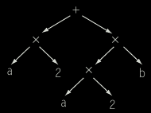
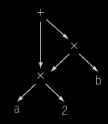
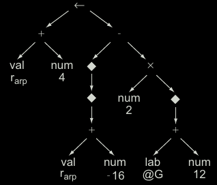
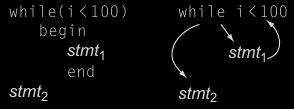
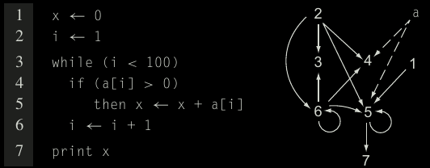

# Intermediate Representation
## category
1. Graphical IR
encode in graph, algorithm expressend in terms of graphical objects (node,edge,list,tree)
2. Linear IR
pseudo-code for some abstract machine
3. Hybrid IR
elements of both graphical and linear IR

## level of abstraction
1. near-source representation
single node represent array access / procedure call to low-level representation
several IR op combine to form target-machine op

to get array ref A[i,j]:
source level tree: subscript(A,i,j)
ILOC code: (subl ...) long list of low level computation

source level tree: easy to find and compare ref
- tree node remain intact under optimization
ILOC code: optimization might move part of address computation elsewhere

linear IR have relatively high-level construct, eg. max,min,str_copy

## namespace 
low-level: choose names for variety of distinct values
```
a - 2*b 
==>
t1 <- b
t2 <- 2 x t1
t3 <- a
t4 <- t3 - t2
```
naming scheme determine size of compile-time data structure
cost of generating and manipulating IR affect compiler's speed

## Graphical IR
### syntax-related tree
parse tree is one of special form of treelike IR
need traverse all nodes and edges => worth shrink tree

optimize: abstract away nodes that serve no purpose

### AST
near source format
if use pair format, need special code for each element in pair
- prefer simplification
- many compiler and interpreter use



### Directed Acyclic Graphs
contraction of AST that avoids duplication
eg. in AST, duplicated `ax2` in `ax2 + ax2xb`



evaluate `ax2` once, use result twice
nodes can have multiple parents, identical subtrees reused

usage
1. reduce memory usage
2. expose redundancies, better compiled code

low level AST

dereference variable to get actual value

### Graphs
trees natural represent grammatical structure, not good at represent other properties

#### control-flow graph (CFG)
basic block: max length sequence of branch-free code
- seq of ops that execute together, unless exception

model flow between basic blocks in program
CFG is directed graph, node -- basic block, edge -- possible transfer of control


alternative: single-statement block => simplify algorithms for analysis and optimization
single-statement block: more nodes and edges, use more memory, take longer to traverse
basic block: better?

#### data dependence graph
encode flow of values from definition to where it use


derivative IR, for specific task then discard

#### call graph
call graph: represent runtime transfer of control between procedures
node for each procedure, edge for each distinct procedure call site

interprocedural analysis: examine interaction across procedures
intraprocedural analysis:  interaction within procedure

compilcation:
1. compile small subsets of program independently, limit ability to build call graph
  - some build partial call graph for all procedures
  - must present all to compiler at once

2. procedure-valued param both as input param and return value
  - => ambiguous call site
  - potential to call different procedure on each invocation
  - need to limit set of edge by interprocedural analysis

3. OO program need additional type information
  - some lang type cannot be known until runtime


# Linear IRS
assembly lang program is form of linear code

seq of instructions execute in order
instruction may contain > 1 operation
resemble assembly code for an abstract machine

control flow in linear IR model control flow implementation on target machine
- include conditional branches and jumps

examples
- one-address codes => accumulator machines and stack machines
  - expose machine's use of implicit names
  - compact code
- two-address codes => model machine has destructive operations
  - memory constraint less importatn
- three-address codes => machine most ops take 2 operands, produce result
  - popular in RISC architecture 

## stack machine code
all results and args transitory
simple to generate and execute
eg. Smalltalk 80, Java

## three-address code
has form `i <- j op k`

adv
1. reasonably compact
2. separate name for operand and target => free to reuse names and values
3. modern processor implements three-address code => model them well

more complex op, eg. max,min

## representation
quadruples: (operator, 2 operands/sources, destination)

implementation
1. simple array
to move load of b ahead, require save 4 fields of first op
copy fields from 2nd slot to 1st slot
overwrite field in 2nd slot with saved values for immediate load

2. array of pointers
similar 3 steps

3. linked list
similar 3 steps

LLVM (low level virtual machine) is linear three-address code
- explicit support for array and structure addresses


## linear code -> control flow graph
compiler often must convert between different styles of IRs

algorithm should track which labels are jump targets
- if code contains ambiguous jumps, must treat labelled statements as leaders

ambiguous jump may force compiler to introduce edge
leader = initial operation of block

if ambiguous jump => treat all labelled statements as leaders
some lang allow jumps to labels outside current procedure
- branch target can be modelled with new CFG node
- must know target label is target of nonlocal brance

## mapping values to names
### naming temporary values
source code:
a <- b+c
b <- a-d
c <- b + c
d <- a - d

source names:
t1 <- b
t2 <- c
t3 <- t1 + t2
a <- t3
t4 <- d
t1 <- t3 - t4
b <- t1

value names:
t1 <- b
t2 <- c
t3 <- t1 + t2
a <- t3
t4 <- d
t5 <- t3 - t4
b <- t5

use of b in first and third statement has distinct values
reuse of name b conveys no information

### static single assignment form (SSA)
encode information about flow of control and flow of data values
- names <-> specific definition points in code

program in SSA
1. each definition has distinct name
2. each use refer to single definition


