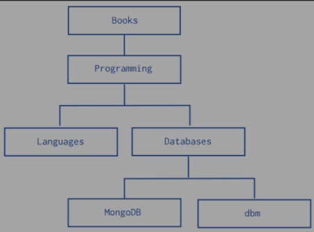
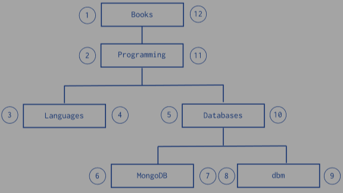

# install & upgrade
I have similar problem, I've upgraded on Ubuntu 16.04 from MongoDB 3.4 to 3.6 but I missed this important step

db.adminCommand( { setFeatureCompatibilityVersion: "3.4" } )

Then I must downgrade to 3.4 to do it and then upgrade to 3.6 again. Here is the detail steps:

1. Uninstall 3.6

Backup /etc/mongod.conf
Backup /etc/apt/sources.list.d/mongodb-org-3.6.listed (rename or move it to another folder)

sudo apt-get update
sudo apt remove mongodb-org-mongos mongodb-org-server mongodb-org-shell mongodb-org-tools

2. Re-install 3.4
Check folder /etc/apt/sources.list.d/ to see if this file exists or not: mongodb-org-3.4.list. 
If it does not exist, you can re-create by this command:

echo "deb [ arch=amd64,arm64 ] http://repo.mongodb.org/apt/ubuntu xenial/mongodb-org/3.0.5 multiverse" | sudo tee /etc/apt/sources.list.d/mongodb-org-3.0.5.list

then install by apt-get
```
sudo apt-get update
sudo apt-get install -y mongodb-org
mongod --version
sudo systemctl start mongod
```
In my case the command systemctl start mongod return error Failed to start mongod.service: Unit mongod.service not found I resolved by these commands:

sudo systemctl enable mongod
sudo service mongod restart
sudo service mongod status

3. Execute very important command
After downgrade to 3.4, run this

mongo
MongoDB shell version v3.4.10
connecting to: mongodb://127.0.0.1:27017
MongoDB server version: 3.4.10
> db.adminCommand( { setFeatureCompatibilityVersion: "3.4" } )
{ "featureCompatibilityVersion" : "3.4", "ok" : 1 }
> exit

4. Upgrade 3.6 again
Restore this file /etc/apt/sources.list.d/mongodb-org-3.6.listed

sudo apt-get update
sudo install mongodb-org-mongos
sudo install mongodb-org-server
sudo install mongodb-org-shell
sudo install mongodb-org-tools

Restore /etc/mongod.conf. Now, MongoDB 3.6 started without any problem


echo "deb [ arch=amd64,arm64 ] deb https://repo.mongodb.org/apt/ubuntu trusty/mongodb-org/3.0 multiverse" | sudo tee /etc/apt/sources.list.d/mongodb-org-3.0.list


# data model
## embedded data model
denormalized model, store related pieces of into in same db record
with MMAPv1 storage engine, impact write performance => data fragmentation
- use Power of 2 sized allocation for document growth
- documents in mongodb must < max BSON document size
max size = 16MB; to store >16MB, use GridFS API

## normalized data model
use when
- embedding result in data duplication, but no read adv
- represent more complex many-to-many relation
- model large hierarchical data set

=> `$lookup`, `$graphLookup` for relation

## operational factor, data model
if applications require update frequently cause document growth
- may refactor data model to use ref between data in distinct documents

## atomicity
operations atomic at document level
if application tolerate non-atomic update for 2 piece of data => store in separate doc

## sharding
sharding for horizontal scaling
allow user to partition a collection within db, distribute collection's doc across multiple mongod instances / shards
- use shard key partition

## large num of collections
having many collections no significant performance penalty
- each collection few kB
- single namespace file (<DB>.ns) store all metadata (index,collection) for db
- has limit on size of .ns
- limit on num of namespace

## large num of small documents
if frequently do grouping, consider "rolling up" / embedded data model
"roll up" docs into logical grouping: seq read + fewer random disk access

## storage optimization for small doc
specify value for _id explicitly when inserting doc into collection
- can store any value in _id

use shorter field names

## data lifecycle management
Time to live / Capped collections (FIFO) only store recent documents

## validation
use `$jsonSchema` for schema validate 
```js
db.createCollection("student", {
  validator: {
    $jsonSchema: {
      bsonType: "object",
      required: ["name","year","major","address"],
      properties: {
        name: {
          bsonType: "string",
          description: "must be string and required"
        },
        major: {
          enum: ["MAth","eng","CS",null],
          description: "only be one of enum"
        },
        address: {
          bsonType: "object",
          required: ["city"],
          properties: {
            street: {
              bsonType: "string",
              description: "msut be stirng if field exists"
            },
            city: {
              bsonType: "string"
            }
          }
        }
      }
    }
  }
})
```
validation during udpates and inserts, existing docs not validate until modification

validationLevel
- strict: validate all inserts and udpates
- moderate: validate insert and updates to existing docs that already fulfill validate criteria

## tree structure


1. parent ref
```js
db.categories.insert( { _id: "MongoDB", parent: "Databases" } )
db.categories.insert( { _id: "dbm", parent: "Databases" } )
db.categories.insert( { _id: "Databases", parent: "Programming" } )
db.categories.insert( { _id: "Languages", parent: "Programming" } )
db.categories.insert( { _id: "Programming", parent: "Books" } )
db.categories.insert( { _id: "Books", parent: null } )
```
2. child ref
```js
db.categories.insert( { _id: "MongoDB", children: [] } )
db.categories.insert( { _id: "dbm", children: [] } )
db.categories.insert( { _id: "Databases", children: [ "MongoDB", "dbm" ] } )
db.categories.insert( { _id: "Languages", children: [] } )
db.categories.insert( { _id: "Programming", children: [ "Databases", "Languages" ] } )
db.categories.insert( { _id: "Books", children: [ "Programming" ] } )
```

3. array of ancestors
efficient way find descendants and ancestors of node
```js
db.categories.insert( { _id: "MongoDB", ancestors: [ "Books", "Programming", "Databases" ], parent: "Databases" } )
db.categories.insert( { _id: "dbm", ancestors: [ "Books", "Programming", "Databases" ], parent: "Databases" } )
db.categories.insert( { _id: "Databases", ancestors: [ "Books", "Programming" ], parent: "Programming" } )
db.categories.insert( { _id: "Languages", ancestors: [ "Books", "Programming" ], parent: "Programming" } )
db.categories.insert( { _id: "Programming", ancestors: [ "Books" ], parent: "Books" } )
db.categories.insert( { _id: "Books", ancestors: [ ], parent: null } )
```

4. materialized path
can add index on path
```js
db.categories.insert( { _id: "Books", path: null } )
db.categories.insert( { _id: "Programming", path: ",Books," } )
db.categories.insert( { _id: "Databases", path: ",Books,Programming," } )
db.categories.insert( { _id: "Languages", path: ",Books,Programming," } )
db.categories.insert( { _id: "MongoDB", path: ",Books,Programming,Databases," } )
db.categories.insert( { _id: "dbm", path: ",Books,Programming,Databases," } )
```
5. nested set
each node in tree as stops in round-trip traversal of tree

```js
db.categories.insert( { _id: "Books", parent: 0, left: 1, right: 12 } )
db.categories.insert( { _id: "Programming", parent: "Books", left: 2, right: 11 } )
db.categories.insert( { _id: "Languages", parent: "Programming", left: 3, right: 4 } )
db.categories.insert( { _id: "Databases", parent: "Programming", left: 5, right: 10 } )
db.categories.insert( { _id: "MongoDB", parent: "Databases", left: 6, right: 7 } )
db.categories.insert( { _id: "dbm", parent: "Databases", left: 8, right: 9 } )

// find descendant of a node
var databaseCategory = db.categories.findOne({_id: "Databases"})
db.categories.find({ left: {$gt: databaseCategory.left }, right: {$lt: databaseCategory.right} })
```

## numeric model
decimal BSON type: decimal-based floating-point format, provide exact precision
`NumberDecimal()`

scale factor: convert to monetary value to 64-bit integer (long BSON type)

## non-numeric model
1 field exact monetary value as non-numeric string ,
1 field binary-based floating-point (double BSON type)

## time
store times in UTC by default, convert any local time representations into this form

## DBRefs
convention foir representing a document, not specific reference type
`$ref`: collection name, `$id`: _id value, `$db`: db name


# index
auto create index on _id; each index need >= 8kB
mongo use B-tree index

## command
show index usage
```js
db.ag_bet.aggregate([ 
    { $indexStats: {} }    
]).toArray()

db.authors.getIndexes()
```

drop index
`db.accounts.dropIndex({ "tax-id": 1})`
remove all index
`db.accounts.dropIndexes()`

control index use
`db.people.find({zipcode: {$gt: "63000"}}).hint({ zipcode: 1})`

view execution stat for specific index
```js
db.people.find(
   { name: "John Doe", zipcode: { $gt: "63000" } }
).hint( { zipcode: 1 } ).explain("executionStats")
```

## single field field
`db.records.createIndex({score: 1})`
`db.records.createIndex({"location.state": 1})`

for single field, sort order not matter, can traverse index in either direction

## compound index
cannot create index for hashed index type
index sort order matters

`db.events.createIndex({ "username":1, "date": -1})`
can support {username:-1, date:1}, {username:1, date:-1}
cannot support {username:1, date:1}, {username:-1, date:-1}


`db.events.createIndex({ "username":1, "date": 1})`
can support {username:1, date:1}, {username:-1, date:-1}
cannot support {username:-1, date:1}, {username:1, date:-1}

## multikey index
create index key for each element in array
`db.coll.createIndex({ <field>: 1/-1})`

- cannot create compound key of 2 arrays
- if compound multiple key already exists, cannot insert doc violate restriction

### multi key bound
bound of index scan define portion of index to search during query
`a:[[3,Infinity]], b: [[-Infinity, 6]] `
if mongodb cannot compound 2 bounds, always constraint index scan by leading field (this case a)

### WiredTiger
if query specifies multiple predicates on indexed scalar field of compound multikey index
- will intersect bounds for the field

### MMAPv1
cannot combine bounds for scalar field for compound multikey index

## text index
a collection can have at most 1 text index

## hashed index
maintain entries with hash value of indexed field
support sharding using hashed shard keys
- use hashed index of field as shard key 
any single field support, collapse embedded docs; not support multi-key (ie. arrays) indexes

`db.collection.createIndex({_id: "hashed"})`
- hash index + non-hashed index both exist

## TTL index
special single-field index use to auto remove docs from collection after certain time
ignore compound indexes
`db.eventlog.createIndex({"lastModifiedDate": 1}, {expireAfterSeconds: 3600})`

## unique index
enforce uniqueness for indexed fields
single/compound index 
cannot use on field already with duplicated data, cannot use on hashed index
only 1 missing value for unique field

## partial index
only index document in collection that meet specified filter expression
```js
db.restaurant.createIndex(
  {cuisine: 1, name: 1},
  { partialFilterExpression: {rating: {$gt: 5}}}
)
```
only index documents with rating > 5
if search for doc with rating < 5, cannot use partial index
more expressive than sparse index

Cannot create multiple version of index that only differ in options
if apply both partial and unique option, unqiue constraint only applies to documents that meet filter expression

## case insensitive index
caes insensitve index not affect result of query for special collation, but increase performance

assume there exists names ("Betsy","BETSY","betsy")
```js
db.names.find({
    first_name: "betsy"
}).collation({ locale: 'en', strength: 2})
```
return result: "Betsy","BETSY","betsy"

## sparse index
only contains docs that has indexed field, even contains null
`db.address.createIndex({"xmpp_id": 1}, {sparse: true})`

if both sparse and unique index true, allow insert multiple null indexed field

## background building index
`db.people.createIndex({zipcode:1}, {background: true})`
db remains available during index building

use incremental approach slower than normal "foreground" index build
- if index > available RAM, then take much longer

## index intersection
can employ multiple/nested index intersection to resolve a query

create index: `{ status: 1 }, { ord_date: -1 }`
can support 
```
{ status: {$in: ["A","P"]}},
{ ord_date: {$gt: new Date("2014-02-01")}, status: {$in: ["P","A"]} }
{ ord_date: {$gt: new Date("2014-02-01")}}
```

# Indexing strategy
consider
1. kinds of query expect
2. ratio of reads to writes
3. amount of free memory in system

ensure index fit in RAM, avoid reading index from disk


# optimization
## speed
find > aggregate > map-reduce

## command
dropIndex, dropIndexes
reIndex(), getIndexes()
totalIndexSize

`db.collection.createIndex({name: -1})`
clear cache: `db.referenceDataPoints.getPlanCache().clear()`


# concept
## format
bson = binary format of json

## _id
always first field, as primary key

options:
- auto generate ObjectId
- auto incrementing number
- generate UUID in application code
- driver's BSON UUID facility

## data structure
String, Integer, Boolean
Double
Min/Max keys: compare a value with max & min of BSON element
Arrays
Timestamp, Object, Null
Symbol: basically equivalent to String
Date
ObjectID
Binary date
Code: store JS code
Regular Expression


# mongo shell method
## insert new field
db.account.update({_id:154}, {$set: {username: 'peter'}})

## import 
bson: mongorestore -d universe -c test test.bson
json: mongoimport -d universe -c test test.metadata.json

## collections
aggregate()
count()
createIndex()


# ~sql operation
## select
```sql
select id,name 
from db.universe 
where (id in (40, 35)) OR name = "Denamrk"
order by id DESC
limit 10
```
=>
```js
db.universe.find({
  $or: [
    {"id": {$in: [40,35]}},
    {"name": "Denmark"}
  ]
}, {"id":1, "name":1} )
.sort({"id": -1})
.limit(10)
```

## insert
- insert, insertOne, insertMany

## update
- updateOne, updateMany
```
db.people.updateMany(
   { age: { $gt: 25 } },  // condition
   { $set: { status: "C" } }  // set value
)
```

## save
update(): update existing value in document
save(): replace old document with new one

## delete
- deleteOne, deleteMany

delete from people
=> db.people.deleteMany({})

delete from people where status="D
=> db.people.deleteMany({ status: "D" })


# SQL <=> MongoDB
database              = database
table                 = collection
row                   = document / BSON document
column                = field
index                 = index
table joins           = `$lookup`, embedded documents
primary key           = primary key
select into new_table = `$out`
merge into table      = `$merge`
transactions          = transactions

mysqld = mongod
mysql  = mongo

# operator
## String
`sql: xx like '%x' => { $regex: /x$/i }`

## between
```
$and: [ {"age": {$gt:20}}, {"age": {"$lt":60}} ]
  ===
"age": {$gt:20, $lt:60}
```
## field operations
`$expr: {$lt: ["$num", "$age"]}`

## computational filter
```
$expr: {
    $lt:[ {
      $cond: {
          if: { $gte: ["$qty", 100] },
          then: { $divide: ["$price", 2] },
          else: { $divide: ["$price", 4] }
        }
    }, 5 ] }
```

## array
exact match: `{arr: [1,2]}`
contains all: `{ arr: {$all: [1,2]} }`
contains any: `{arr: { $elemMatch: {$gt: 3}}}`
match size of array: `{arr: {$size: 2}}`

### get first
```
find({ arr: {$gte: 3} }, {"arr.$": 1 })

// get first 2 elements of arr
find({arr: {$gte: 3}}, {arr: {$slice: 2}})
// get last 2 elements 
find({arr: {$gte: 3}}, {arr: {$slice: -2}})
// offset 1, take 2
find({arr: {$gte: 3}}, {arr: {$slice: [1,2]}})
```

## unwind
expand array to rows
```json
{
  "jane": "jane",
  "likes": ["golf","racquetball"]
}
==>
{ "jane": "jane", "likes": "golf" }
{ "jane": "jane", "likes": "racquetball" }
```

## special
`$exists`: whethere document has specific field


# aggregation stages
## addField
add field
## bucket
```js
$bucket: {
  groupBy: // group by field
  boundaries: // specify boundaries for each bucket
  dafault: // for elements not fall into any buckets
    // eg. [0,200,400] -> [0,200),[200,400)
  output: {
    // accumulator: expression
  }
}

// bucket
{ $bucket: {
    groupBy: "$pop",
    boundaries: [0,10,20,100,400,1000,5000,10000],
    default: "others",
    output: {
        "count": {$sum: 1},
        "state": {$addToSet: "$state"}
    }
  }
}
```

## facet
facet contains 2 components:
bucket by price, bucket by year

```js
db.artwork.aggregate([
  {
    $facet: {
        "price": [{
            $bucket: {
              groupBy: "$price",
              boundaries: [0,200,400],
              default: "others",
              output: {
                  "count": {$sum: 1},
                  "artwork": { $push: {"title":"$title", "price":"$price","year":"$year"}}
              }
            }
        }],
        "year": [{
            $bucket: {
              groupBy: "$year",
              boundaries: [1890,1910,1920,1940],
              default: "unknown",
              output: {
                  "count": {$sum:1},
                  "artwork": {$push: {"title":"$title", "price":"$price", "year":"$year"} }
              }      
            }
        }]
    }
  }
])
```
## bucketAuto
group documents into 
```js
{$bucketAuto: {
        groupBy: "$price",
        buckets: 5,
        output: {
            "count": {$sum: 1}
            ,"artwork": { $push: {"title":"$title", "price":"$price","year":"$year"}}
        }
    }}
```
## collStats
get collection information
```js
{ $collStats: {
    latencyStats: { histograms: true},
    storageStats: {},
    count: {}
}}
```
namespace, shard name, host, localTime, latencyStats, storageStats, count

## count
```js
{ $count: "result"}
```

## graphLookup
```js
$graphLookup: {
    from: "employees",  // target collection
    startWith: "$reportsTo",  // start point of recursive search
    connectFromField: "reportsTo",  // field to recursively match connectToField
    connectToField: "name", // match value of connectFromField
    as: "reportingHierarchy"  // array field name
}

// result:
"reportingHierarchy" : [
    { "_id" : 1, "name" : "Dev" },                          // depth 2
    { "_id" : 2, "name" : "Eliot", "reportsTo" : "Dev" },   // depth 1
    { "_id" : 4, "name" : "Andrew", "reportsTo" : "Eliot" } // depth 0
  ]
```

## lookup
```js
db.classes.aggregate([  // join from 'classes' collection
    { $lookup: { 
        from: "members",   // join to 'members' collection
        localField: "enrollmentlist", // join from 'classes' field
        foreignField: "name", // join to 'members' field
        as: "fromItems" // joined result of 'members' data
    }}, {
      $replaceRoot: { // replace all existing fields in input document, including _id
        newRoot: { $mergeObjects: [ // merge fromItems to result collection
            { $arrayElemAt: ["$fromItems", 0] },  // return elem at specific index
              "$$ROOT"  // reference root document (top-level)
        ]}
      }
    }, 
    { $project: { fromItems: 0 } } // ignore fromItems field
])
```
## replaceRoot
`{ $replaceRoot: {newRoot: "$obj"}}`
obj must be a js object, non empty

## out
create new collection in current database if not exists
replace existing collection

1. create temp collection
2. copy indexes from existing collection to temp collection
3. insert documents into temp collection
4. calls db.collection.renameCollection with dropTarget:true
`{$out: "out_collection"}`

## redact
```
mongoDB <---> trusted middleware <----> application
      aggregation               requests
      pipeline with 
      $redact
```
any valid expression that resolve to 
- $$DESCEND: return fields at current level, exclude embedded doc
- $$PRUNE: exclude all fields, no further insepct excluded fields
- $$KEEP: keep all field, no further inspection

## sample
random pick some documents
`{$sample: {size: 3}}`

# aggregate operators
## arithmetic
```
$abs, $add, $subtract, $multiply, $divide
$avg, $ceil, $floor, $cmp, $exp
$ln, $log, $log10
```
## logic
```
$allElementsTrue, $anyElementTrue
$cond, $switch
$eq, $gt, $gte
$truncate
```
## string
```
$concat, $strcasecmp, $strLenBytes
$substr, $substrBytes, $toLower, $toUpper
```
## collection
```
$arrayElemAt, $arrayToObject
$concatArrays
$indexOfArray, $in
$slice, $split, $size
```
### group stage
```
$addToSet
$first, $last
```
## datetime
```
$dateFromParts, $dateToParts, $dateFromString, $dateToString
$dayOf(Month|Week|Year), $hour
```
## set
```
$setDifference, $setEquals, $setIntersection
$setIsSubset, $setUnion
```

## filter
```js
$filter: {
    input: "$items",
    as: "item",
    cond: {
        $gte: ["$$item.price", 100]
    }
}
```
## let
```js
$let: {
  vars: { // create variables
    total: {$add: ['$price', '$tax']},  // create total
    discounted: { $cond: {if: '$applyDiscount', then:0.9, else:1} }
  },
  // ref to total,discounted, return value
  in: { $multiply: ["$$total", '$$discounted'] }  
}
```

## map
```js
$map: {
  input: "$quizzes",
  as: "grade",
  in: { $add: [ "$$grade", 2 ] }
}
```
## objectToArray
{l:25, w:10, uom:"cm"} 
=> [{"k":"l", "v":25}, {"k":"w","v":10}, {"k":"uom", "v":"cm"}]

## switch
```js
$switch: {
  branches: [
    {case: {$gte:["$year", 1918]}, then: "well" },
    {case: {$eq: ["$year", 1893]}, then: "ok"}
  ],
  default: "no..."
}
```

## zip
`$zip: {inputs: [[1,2,3],["a","b","c"]]} => [[1,"a"],[2,"b"],[3,"c"]]`


# aggreagation pipeline
```sql
select sex,sum(num)
from people
group by sex
where age is not null
```
==>
```js
db.people.aggregate([
  {$match: {age: {$exists: true}}},
  {$group: {_id: "$sex", total: {$sum: "$num"} }}
])
```

```js
select sum(pop) totalPop, state
from zips
group by state
having totalPop >= 10*1000*1000

==>

db.zips.aggregate([
    { $group: { _id: "$state", totalPop: {$sum: "$pop"}}},
    { $match: {totalPop: {$gte: 10*1000*1000}}}
])


db.zips.aggregate([
    { $group: { _id: { state: "$state", city: "$city"} , pop: {$sum: "$pop"}}}
    ,{ $group: {_id: "$_id.state", avgCityPop: {$avg: "$pop"}, totalPop: {$sum: "$pop"} }}
    
])

db.zip.aggregate([
    { $group: { _id: { state: "$state", city:"$city" }, pop: {$sum: "$pop"} }},
    { $sort: {pop: 1}},
    { $group: { 
        _id: "$_id.state", 
        biggestCity: {$last: "$_id.city"}, biggestPop: {$last: "$pop"},
        smallestCity: {$first: "$_id.city"}, smallestPop: {$first: "$pop"},
        total: {$sum: "$pop"}
    }},
    {$project: { _id:0, state: "$_id", totalPop: "$total",
        biggestCity: {name: "$biggestCity", pop: "$biggestPop"},
        smallestCity: {name: "$smallestCity", pop: "$smallestPop"}
    }}
])

// 5 most common likes
db.users.aggregate([
  { $unwind : "$likes" },
  { $group : { _id : "$likes" , number : { $sum : 1 } } },
  { $sort : { number : -1 } },
  { $limit : 5 }
])


db.zips.aggregate(
  {$group: {_id: "$state", total: {$sum: 1}}} ,
  {$addFields: { homework: {$add: ["$total",300]}  , total:{tot: "$total", b:2}  }},
  {$addFields: { apk: {$concatArrays: [[1,2], [3,4]] }}}
)


```

first stage: filter documents
second stage: group documents by certain field

can use index to improve performance during some stages

### pipeline
consist of stages
pipeline stages can appear multiple times except $out,$merge,$geoNear

### pipeline expression
specify transformation to apply to input documents
- only operate on current document, cannot refer to others
- in-memory transformation
- generally stateless, only evaluated when seen by aggregation except accumulator
  - accumulator use $group to maintian state (total,max,min,related data)

### early filtering
if only need subset of data => use $match, $limit, $skip


## map-reduce
1. map stage
process each document, emit >=1 objects for each input document
2. reduce stage
combine output of map operation
3. finalize stage (optional)
make final modification to result

use custom js functions to perform map,reduce,finalize operations
- arrow function not working, since no this binding

can write results to collection / return results inline
- if return inline, size must < 16MB

```sql
select sex,sum(num)
from people
group by sex
where age is not null
```
==>
```js
db.people.mapReduce(
  function(){ emit(this.sex, this.num) },
  function(key,value){ return Array.sum(value) },
  {
    query: { age: {$exists: true} },
    out: "xxx"
  }
)


db.people.mapReduce(
    function(){
        this.obj2.forEach(i => emit(i.sku, {count:1, qty:i.qty}))
    }, 
    function(key,vals){
        return vals.reduce((i,j) => {
            return {count: i.count+j.count, qty: i.qty+j.qty }
        }, {count:0, qty: 0})
    },
    {
        out: {merge: "map_reduce_ex"},
        // query: { age: {$exists: true}},
        finalize: function(key, reducedVal){
            reducedVal.avg = reducedVal.qty / reducedVal.count;
            return reducedVal;
        }
    }
)


```
in general map-reduce less efficient, more complex

### map-reduce and sharded collection
if input = sharded collection, auto dispatch map-reduce job to each shard in parallel
if output = sharded collection, shard using _id as shard key

- during post-processing, each shard put result for its own chunks from other shards
- run final reduce/finalize => write locally to output collection

## concurrency
takes following locks:
- read phase => every 100 documents : read lock
- insert into temp collection => single write : write lock 
- output collection not exist => create output collection : write lock
- output collection exist => output action : write lock (global, block all operations)


## single purpose aggregation operation
db.people.count()

`select distinct sex from people`
==> `db.people.distinct("sex")`


# database
switch to (create if not exists) db: `use testdb`
`show dbs`
show collections

## drop db
use testdb; db.dropDatabase()


