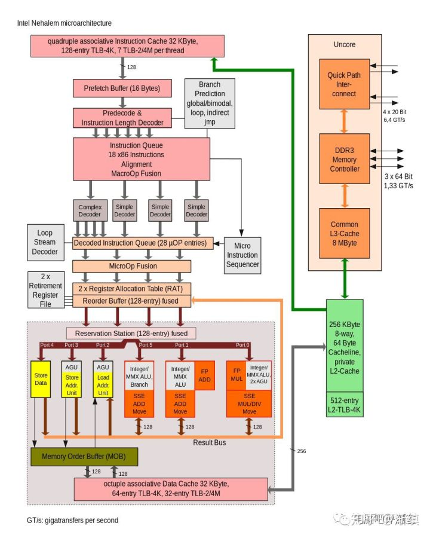

# CPU bus
## Front Side bus
```
                  memory
                    | memory
                    | bus
  --AGP bus--- North Bridge ---frontside bus--- CPU
                    |
                    |
               South Bridge ---PCI bus--- graphics card
                    |
                    |ATA bus
                    |
                hard disk
```
eg.
CPU external clock = 66MHz, FSB need to keep also 66MHz
Quad Pumped Bus: 4x speed for FSB

## HyperTransport Link (HT Link)
duplex speed: 12.8 GB/s
CPU0 <--HT Link--> CPU1

## QPI (QuickPath Interconnect) Link
initial speed: 25.6 GB/s
CPU internal memory controller bus


## Infinity Fabric
derive from HT bus
speed = 512 GB/s
classificed as SDF: data transfer, SCF: command control 
can use on CPU, GPU, APU

## intel UltraPath Interconnect (UPI)
point to point process interconnect, replace QPI in Xeon
interconnect or scalable multiprocessor system with shared address space

# PCH (platform controller hub)
PCIE lane = cpu lane + PCH lane

family of intel chipset (from 2008)
controls certain data paths and support functions used in conjunction with intel CPU
  - include clocking, flexible display interface (FDI), direct media interface (DMI)

some north bridge functions, memory controller and PCIe lanes integrated into CPU
PCH take over remaining functions in addition to southbridge roles


# form factor
WTX     356x425
HPTX    345x381
EE-ATX  347x330
EEB   305x330
standard-ATX   305x244
micro-ATX   244x244
mini-ITX  170x170 mm
mini-STX(5x5) 147x140
intel nuc   102x102
mini lake   102x64
compute stick   30x90


