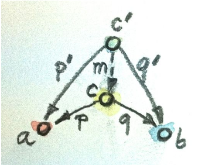
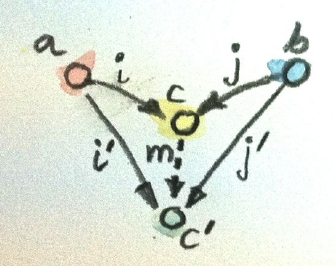

# fundamental
category: abstraction of all mathematical objects
morphism: arrow for mapping of objects

# Types
types are restrictions on composition(morphism) 
  eg. one arrow must be source object of next arrow
stronger type system, better match can be described an verified

Types = sets of values, can be finite or infinite

## halting problem
a program cannot determine whether one program is non-terminating / terminating
so we introduce ⊥: never terminate

function that may return bottom = partial, opposed to total functions
  => return valid results for every possible argument

## semantics of language
operational semantics: mechanics of program execution
denotational semantics: every programming constuct is given its mathematical interpretation

computational effect can be mapped to monads

# Curry-Howard Isomorphism

## universal construction
definition of object as "unique-up-to-isomorphism object satisfying certian universal property"

# Products and Coproducts
## initial object
object that has one-and-only-one morphism going to any object in category
absurd :: Void -> a

## terminal Object
object that has one-and-only-one morphism coming to it from any object in category

## Duality
for every category C, we can define opposite category C_op

f :: a -> b
g :: b -> c
h = g ∘ f

f_op :: b -> a
g_op :: c -> b 
h_op = f_op ∘ g_op

## Isomorphism
sense: object equality in category
intuition: every part of one object correspond to some part of another object (1-to-1)
- a -> b and b -> a

Morphism g = inverse of f if composition is identity
f ∘ g = id
g ∘ f = id

## product
product of 2 objects a,b = object c equipped with 2 projections s.t.
for any object c' with 2 morphism, unique morphism m :: c' -> c

fst :: (a,b) -> a
fst (x,y) = x

snd :: (a,b) -> b
snd (x,y) = y

===>
from same product map to 2 different set
p :: c -> a
q :: c -> b

eg.
p :: (Int, Int, Bool) -> Int
p (x, _, _) = x
q :: (Int, Int, Bool) -> Bool
q (_, _, b) = b

ranking
- c compare with candidate object c', and 2 projection p',q'
- c is "better" than c' if there's moirphism m :: c' -> c

p' = p . m
q' = q . m
(m factorizes p' and q')

===>

m :: Int -> (Int, Bool)
m x = (x, True)

p x = fst (m x) = x
q x = snd (m x) = True

factorizer :: (c -> a) -> (c -> b) -> (c -> (a, b))
factorizer p q = \x -> (p x, q x)

## coproduct
coproduct of 2 objects a,b = object c with 2 injections s.t.
for any object c' with 2 injections, unique m :: c -> c'

ranking:
- object c "better than" object c' with injection i',j'
- if m :: c -> c'
i' = m . i
j' = m . j

data Contact = PhoneNum Int | EmailAddr String
(PhoneNum, EmailAddr are injections)

factorizer :: (a -> c) -> (b -> c) -> Either a b -> c
factorizer i j (Left a) = i a
factorizer i j (Right b) = j b

## Asymmetry
in category of set 
- initial object != final object
- product != coproduct

empty set has unique morphism to any set, no morphism come back

