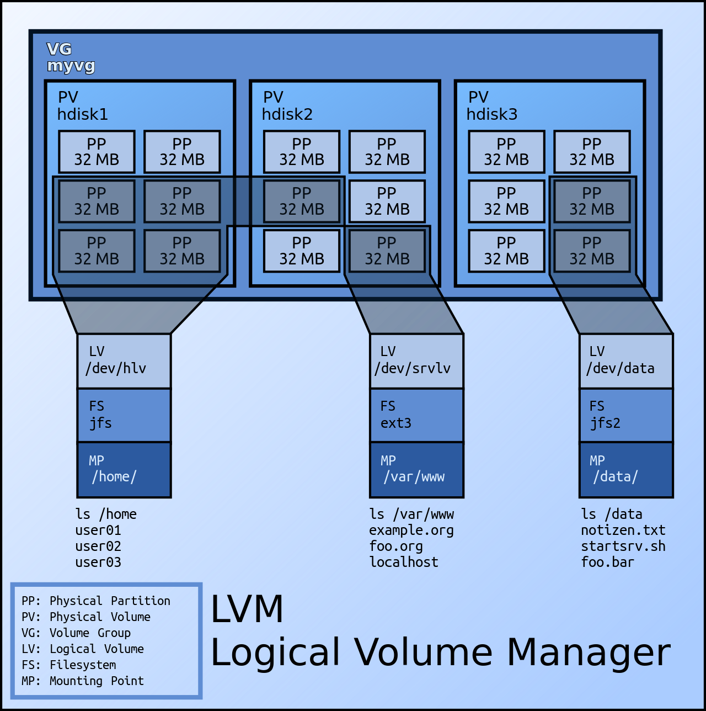

# LVM (logical volumn manager)
abstract low level physical disk
when operate, only manage logical volume

LV (logical Volume)
- unallocated volume can create new logical volume
- dynamically scale / minimize space

VG (volume group): group of PV
PV (physical volume): physical partition / raid / disk
PP (physical partition)

## uses
1. single logical volume of multiple physical volumes
2. manage large hard disk farms, allow dynamic add/replace without downtime
  - hot swapping
3. consistent backups by taking snapshots
4. encrypt multiple physical partitioins with 1 password

## snapshot
snapshot for logical volume
when create snapshot, only copy metadata in original volume, not physical data copy
- realtime

when original volume write operation, snapshot monitor changes
- copy-on-write: copy orig data chunk to snapshot space before update
- once snappshot space full of update info from original volume
  - snapshot released and invalidated

