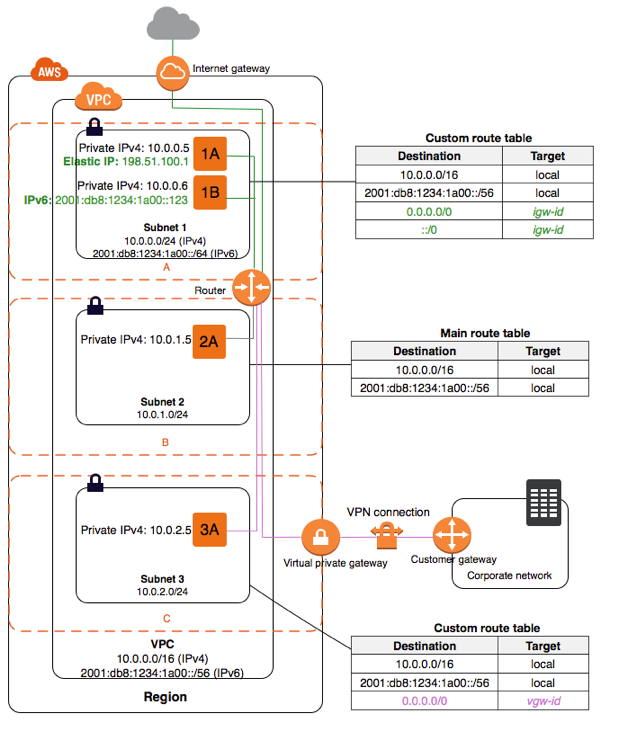

virtual private cloud (VPC)

# security group
virtual firewall
inbound: protect network against incoming traffic from internet
outbound: filter outgoing traffic from own server (rarely setup)

instance up to 5 security group
- act at instance level, not subnet level

## basics
- can specify allow rules, not deny rules
- default no inbound rules, allow all outbound traffic
- security group associated with network interfaces

## default rule
inbound:
security group id (sg-xxxx): allow inbound traffic from same security group

## rules
can grant access to specific CIDR range 
/ another security group in VPC 
/ peer VPC

# connect to rds 
## in same VPC
1. create VPC security group for DB in
2. create VPC security group for EC2 instances
  - eg. allow access to EC2 via VPC's routing table
3. create custom rule that allow connection from security group for EC2

# basis
route table: set of rules determine where network traffic directed
internet gateway: 
horizontal scaled, redundant that allow communication between instances in VPC and internet
endpoint: privately connect VPC by PrivateLink without internet gateway, NAT, VPN, AWS direct connect

# subnet
when create VPC, must specify range of IPv4 address for VPC 
in form of Classless Inter-Domain Routing (CIDR) block 

VPC spans all availability zones in region
- optionally add subnets in Local Zone
  - AWS infrastructure deployment place compute,storage,db closer to end user 
- weh ncreate subnet, specify CIDR block for subnet
- each subnet must reside entirely in 1 AZ
- unique ID to each subnet

public subnet: subnet's traffic routed to internet gateway (subnet1)
priavte subnet: not have route to internet gateway (subnet2)

if want instance in public subnet communicate with internet over IPv4
- need public IPv4 / elastic IP address

VPN-only subnet: (subnet3)
subnet no route to internet gateway, traffic routed to virtual private gateway

## local zone
seamlessly connect to full range of services in AWS region
extend VPC region by creating new subnet that has local zone assignment

## AWS outposts
subnets must reside in Outpost location

## subnet sizing
default all VPCs and subnets must have IPv4 CIDR blocks

add CIDR block rule:
- allowed block size between /28 and /16 netmask
- CIDR blocks must not overlap 
- cannot change size of existing CIDR block
- VPC quota for num of CIDR blocks

rule for VPC peering:
- if peering connection active, can add CIDR block not overlap with CIDR of peer VPC

Direct Connect to connect multiple VPC
- no overlapping CIDR blocks

## subnet routing
each subnet must associate with route table
every subnet create auto associate with main route table for VPC

## subnet security
security group: instance traffic
netowrk ACLs: control subnet traffic

# VPC peering
link 2 VPCs, not require othe networking pieces

establish conn
1. VPC send request to whom not having overlapping CIDR
2. accept rquest
3. manually add route to >= 1 VPC rout table that point to IP address range of peer VPC
4. update security group rules ensure traffic to and from peer VPC not restricted
5. enable DNS hostname resolution

for multiple VPC peering, transitive peering relationship not supported

