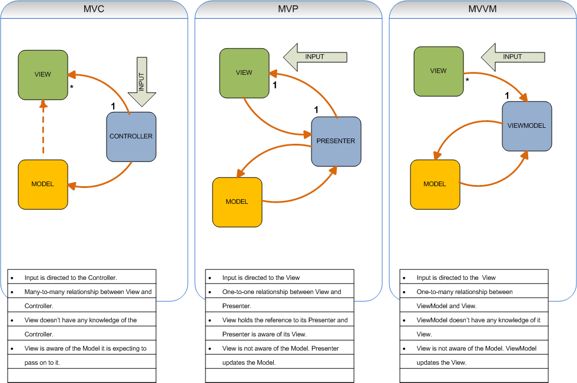

# MVC

Model-View-Controller

model invariant
model not rely on view, view rely on model

## Model
data, state, logic
## View
UI related job, don't know data/logic, don't know interaction state
## Controller
glue model and view together, control two
decide how to interact with model 
  -> new logic result
  -> reflect change in view

## process
when user trigger action
-> controller update model and inform view to update
-> view request data from model

## Problem
- Controller highly coupled with View, if View changed also need modify Controller
- Controller difficult to do unit test
- too many code put into Controller

## conclusion
MVc all action associated with a controller method calling
every action is action to certain URK

input (eg. mouse click) directed to controller first, then controller kick off some functionality
controlelr may render many different views based on operation being executed
controller decide how to response

MOST IMPORTANT: controller

# MVP
Model-View-Presenter

## components
### Model
data, state, logic
### View
should only have simple get/set method
in android, eg. see Activity, Fragment as part of View
implement View Interface, for Presenter <--Interface--> View

### Presenter
glue two together, but not bound to View

## adv
1. modify view not affect model
2. all interaction within Presenter
3. 1 presenter apply to multiple view
4. unit test only on interface

## Problem
still Presenter will grow very large

## Passive view
view is passive, not change any of its state; all states changed by presenter

## supervising controller
turn to implicit data sync
View has simple view and model state
- supervisor try to declare state/data in View

## conclusion
in MVP, view must dispatch event to presenter, if not event cannot be responsed

MOST IMPORTANT: view

# MVVM
Model-View-ViewModel
use data binding technology
## Model
data, state, logic
## View
view as Observable variables, bidirectional interaction with ViewModel
## ViewModel
Data binding leviate work for interaction
only pack Model and Observable Data to View

## properties
view hold ref to view-model, view no idea about model
view-model not aware of view

many views to 1 view-model

# Important point
presentation / ViewModel abstract View, extract state and behavior away from view

## iOS
in iOS, to implement MVVM, use
1. KVO pattern 
2. RxSwift/ ReactiveCocoa
3. make it yourself

