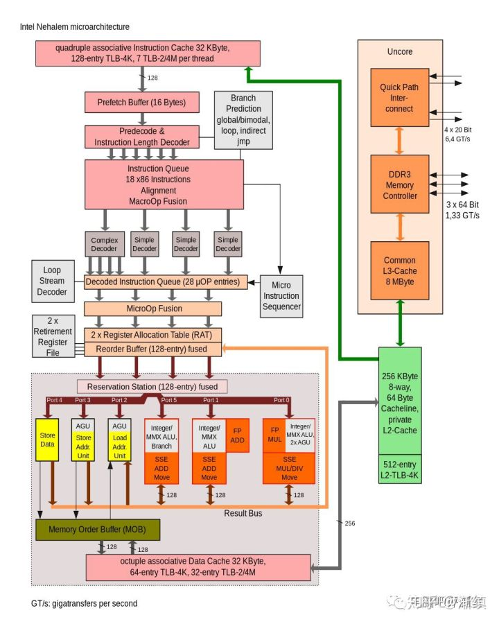

# CPU bus
## Front Side bus
```
                  memory
                    | memory
                    | bus
  --AGP bus--- North Bridge ---frontside bus--- CPU
                    |
                    |
               South Bridge ---PCI bus--- graphics card
                    |
                    |ATA bus
                    |
                hard disk
```
eg.
CPU external clock = 66MHz, FSB need to keep also 66MHz
Quad Pumped Bus: 4x speed for FSB

## HyperTransport Link (HT Link)
duplex speed: 12.8 GB/s
CPU0 <--HT Link--> CPU1

## QPI (QuickPath Interconnect) Link
initial speed: 25.6 GB/s
CPU internal memory controller bus


## Infinity Fabric
derive from HT bus
speed = 512 GB/s
classificed as SDF: data transfer, SCF: command control 
can use on CPU, GPU, APU

## intel UltraPath Interconnect (UPI)
point to point process interconnect, replace QPI in Xeon
interconnect or scalable multiprocessor system with shared address space


