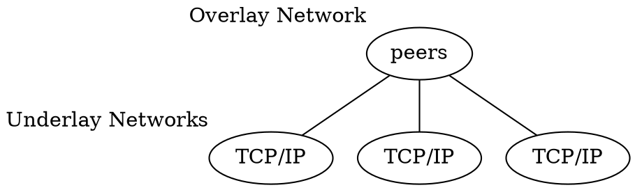

# fundamental
## P2P Group
1:1 : P2P group owner <---> client
1:n : P2P group owner <--> P2P client
                      <--> P2P client
                      <--> Legacy client (not compliant with wifi p2p)

## wifi direct VS wifi hotspot
wifi-driect use P2P communicate directly
wifi-hotspot communicate via middleman (hotspot)

## 系統根據以下流程開啟 wifi

載入 wifi kernel module。在 wifi kernel module 中，主要是透過 ioctl 的方式與 user space 下運行的 wpa_supplicant 進行溝通。
另外在硬體的實現上，由於 CPU 需要有另一個介面與 wifi chip 進行溝通，如 wifi firmware 的載入、command request 以及資料的傳送/接收。目前較為常用的界面為 4bit SDIO (Secure Digital I/O)。
啟動 wpa_supplicant。運行於 user space 下的一個 service，可以在 init.rc 下啟動並初始化這個 service。當然在啟動以及關閉 wifi 時也會一起啟動以及關閉。
建立 wpa_supplicant 以及 wifi kernel module 的 interface 作為實現 wifi 的各種操作如找尋適當 AP (Access Point)、secure method (WPA、WPA2 或 WEP) 或建立/解除與 AP 的連線。

在 user 透過 UI 去啟動 wifi 時，wifi 找不到任何 AP 且畫面一直停留在 scanning…的狀態。相信各位 wifi 開發者在 porting wifi driver 
時應該經常會遇到這樣的問題。或許有人會說是 AP 訊號太弱或是 security method 
軟體啟動流程也有可能出了問題

重新檢視上述啟動流程，可以發現 wifi kernel module 是在 kernel space 進行載入而 wpa_supplicant 是在 user space 下啟動的。如果要正確地控制其啟動流程，較常見的方法是程式中透過 cat /proc/modules。如果可以在 /proc/modules 中讀取到  module name，代表 wifi kernel module 已經載入完成。但顯然在筆者的開發經驗上，這樣的方法上並不能適用於所有的平台。在這樣的情況下，如果在 user space 中因為對 wifi kernel module 確實的載入完成時間有任何的誤判而提前啟動 wpa_supplicant，將會使得 wpa_supplicant 找不到 wifi device 而會有如以下的 error logs 出現

I/wpa_supplicant(  677): rfkill: Cannot open RFKILL control device

E/wpa_supplicant(  677): Could not read interface wlan0 flags: No such device

E/wpa_supplicant(  677): WEXT: Could not set interface ‘wlan0’ UP

E/wpa_supplicant(  677): wlan0: Failed to initialize driver interface

## p2p wifi-direct

sudo wpa_supplicant -D nl80211 -i wlp4s0 -c /etc/wpa_supplicant.conf -B
sudo wpa_cli

# characteristics
1. self organizing: no central control, decentralised resource search (sometimes server assist -> centralized p2p)
2. combined client + server functionality, same code
3. direct interaction between peers (search, data hosting, communication)
4. relevant resource located at private nodes
5. heterogeneous capabilities
6. variable connectivity (churn)

## mobile ad hoc network
no communication infrastrucutre available

## overlay network

P2P network form overlay network
  over underlying telecom infrastructure

- search / lookup data multicast
- data storage publish / subscribe
  
### P2P overlays
friend-of-a-friend network
user-centric networking
content-centric networking / routing (build application around data)

### non-P2P overlays
VPN
IP over ad hoc networks
application-layer multicast
TOR

## Cloud computing
controlled environment: 
- no malicious provider
- no churn
- homogeneous devices
selective centralized structure:
- accounting, monitoring
- single access point
- centralized updaes

on demand self services
rapid elasticity
measured service
resource pooling

=== VS ===

## P2P computing
uncontrolled environment:
- churn, hetero, uncertainty

on demand self services (depend on #users)
rapid elasticity
resource pooling

## why we need P2P?
1. use P2P in cloud backend
-> data storage, big data
2. costs
3. security
4. locality / offline usage

## examples
Bittorrent
eMule
PPLive

# Unstructured P2P overlay networks
## Lookup
given ID, return contact to responsible peer
- need to maintain address structure

## full text search
given sequence of word, return contact to peers with all matching resoures
- no need to know unique name
- need protocol, hard to be efficient

### unstructured P2P
objects no special identifier
location not known 
each peer only responsible for object it submit
eg. KaZaA, eDonkey
- exhaustive search
#### centralized
server to find file owner
eg. centralized DHT
what: object name, file name, criteria
where: (IP, port)
- issue: central server is bottleneck, single point failure
- best for small and simple application
#### homogeneous
equal duty
##### search mechanism
{flood}
breadth-first search (BFS)
- send msg to all neighbors
- use system wide max time-to-live

{expanding ring}
successive floor with increasing TTL
if objects follow Zipf law popularity distribution

{random walks}
query to randomly selected neighbor
- incresed latency

{Rendezvous Point}
storing node, requesting node
#### heterogeneous
different duty

### structured P2P
peer & object have identifier
object stored on peer according to their ID
distributed indexing point to object locations
eg. Adaptive-Chord
- guarentee result if target exists
#### DHT-based

#### Heterogeneous P2P

### flat 
### hierarchical
several overlays exist, each with dedicated function
routing in 1 network -> gateway in another network

### Gnutella
1. peer know at least 1 member node before connection (use host cache)
2. ping request, pong response
3. set up HTTP connection

scalability issue:
- fully decentralized, flooding of messages
- low bandwidth peer use up bandwidth by forwarding msg

optimization:
- num of hops
- super nodes
- file hashes to identify files
- choose to be hierarchy

### Bubblecast
low latency
reliable
precise node count
balanced link load

# BTsync
can be used either in local area network / public network

## tracker server
- BTsync client have several traker server IP address
OR 
- BTsync client first connect to company's website, then get certain configuration file: include ip address and port number

## DHT network
compensate shortcoming of DHT network
need first connect to certain node, then discover other nodes

### difficulty previously
no center
massive data
node dynamic join/leave
efficient query to route

###
assign unique ID to nodes
let node ID = data key

balance: 
- larger route table, less jump needed
- smaller route table, more jump needed

distance algorithm

### locate data
function: put(key,value), get(key)
- save data
when node get new data, 
a = distance(key, myself)
b = distance(key, all known nodes)
if a is minimum:
  keep data itself
else:
  send data to min(b)

- receive data
node receive query to key
dist = distance(key, myself)
other = distance(key, known nodes)
if dist is min:
  search value of key locally
else:
  forward to min(other)

### bootstrap
connect to tracker server, pass throught server to get certain DHT node
predefined host: add (ip, port) in client

### GFW blocking DHT difficulty
1. dynamic nodes 
2. fake BTsync can only detect portion of nodes, not all
3. GFW cannot block data flow within the wall

if machine not connect to DHT network for long time, then node info stored locally will be outdated => need bootstrap again

### keep connection
1. buy VPS, host on non-blocked address VPS and run for long time
2. ask for fixed DHT node

